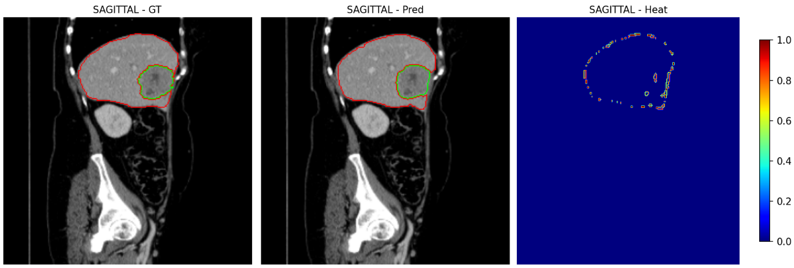
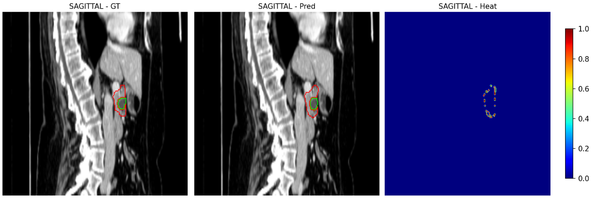

# BAUN3D: Boundary-Attentive 3D-UNet for Auto-Segmentation of Tumor-Prone Organs in Medical CT Volumes

<div align="center">
  
</div>

## Overview 

BAUN3D is a unique anatomy-aware deep learning radiomics for auto-localization and segmentation of organs and tumors in volumetric CT images. Built specifically for contouring the challenging tumor-prone organs, the architecture comprises of: deformable cross attention mechanism, gated boundary refinement (GBR) module, and a composite loss objective function for handling curriculum learning, extreme class imbalance, small tumor targets, and contour structural continuity.


## System requirements

- Python ≥ 3.8
- CUDA ≥ 11.8 (for GPU acceleration)
- 10GB+ GPU memory per GPU


## Dataset

- This version of BAUN3D model was trained and validated with the medical segmentation decathlon (MSD) LiTS and Pancreas benchmark [datasets](https://drive.google.com/drive/folders/1HqEgzS8BV2c7xYNrZdEAnrHk7osJJ--2). 

- Download link to the model weights will be updated later.

### Data Directory Structure
```
data/
├── lits/
│   ├── imagesTr/          # Training images (*.nii.gz)
│   ├── labelsTr/          # Training labels (*.nii.gz)
│   └── imagesTs/          # Test images
├── pancreas/
│   ├── imagesTr/
│   ├── labelsTr/
│   └── imagesTs/
└── ...
```


## Train | Test | Inference 
The training and inference source-codes, and running commands will be publicly released soon. 

## Outcomes

### Quantitative results


| Dataset  | Organ Dice | Tumor Dice | Avg Dice | HD95 (mm)   |
|----------|------------|------------|----------|-------------|
| LiTS     | 0.96       | 0.74       | 0.84     | 5.82        |
| Pancreas | 0.84       | 0.81       | 0.83     | 4.83        |


### Qualitative results

<div align="center">
  
  <p><em>Boundary segmentation sample (Liver/Tumor)</em></p>
</div>
<div align="center">
  
  <p><em>Boundary segmentation sample (Pancreas/Tumor)</em></p>
</div>


### Acknowledgement
Supported by CAIM: Linkou, Chang Gung Memorial Hospital Research Project CLRPG3H0017
