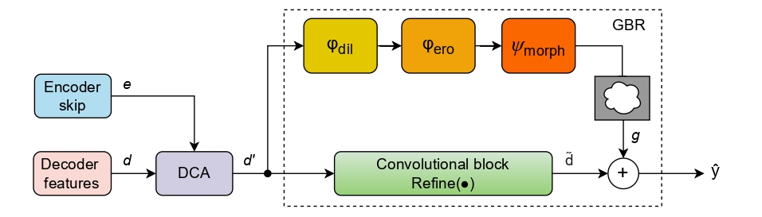
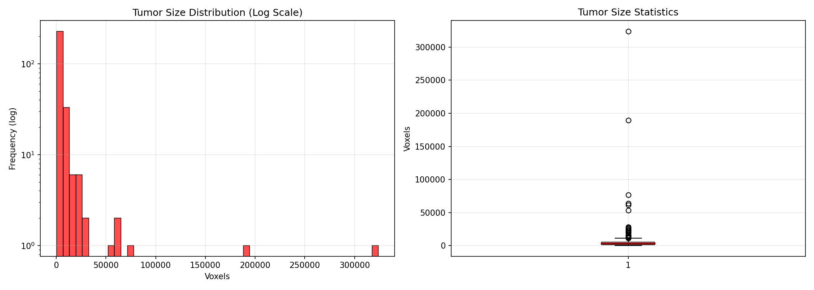
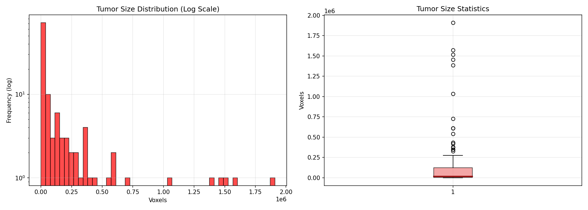
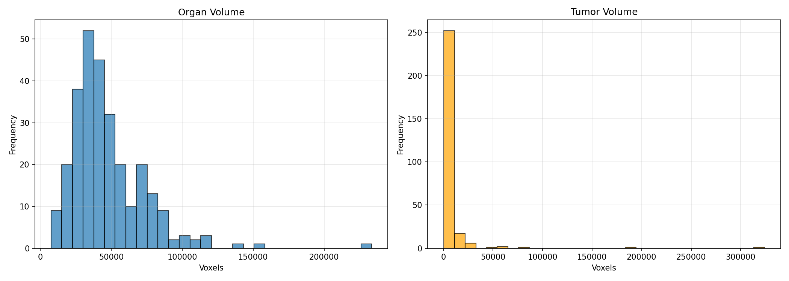
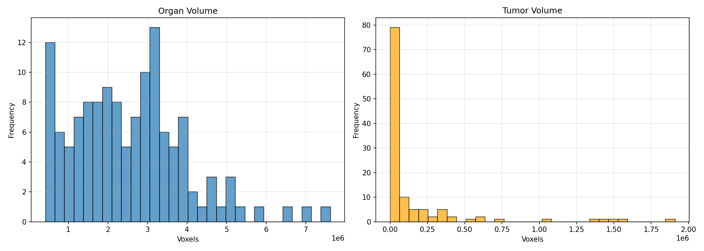
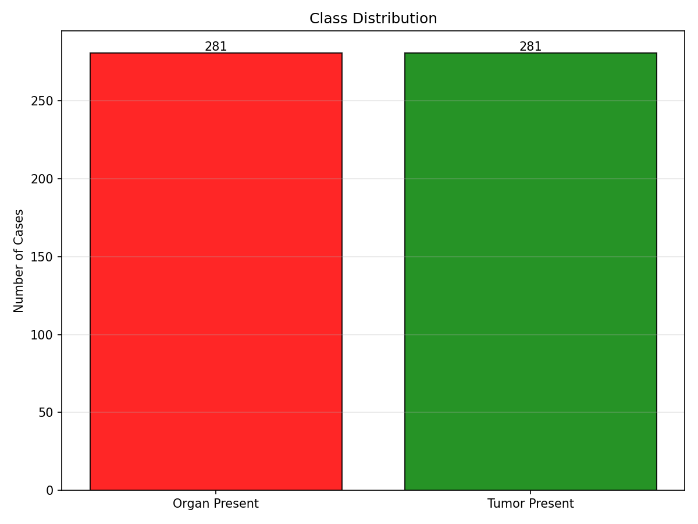
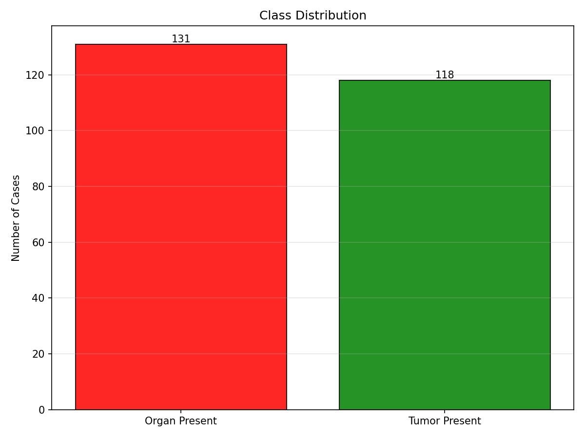
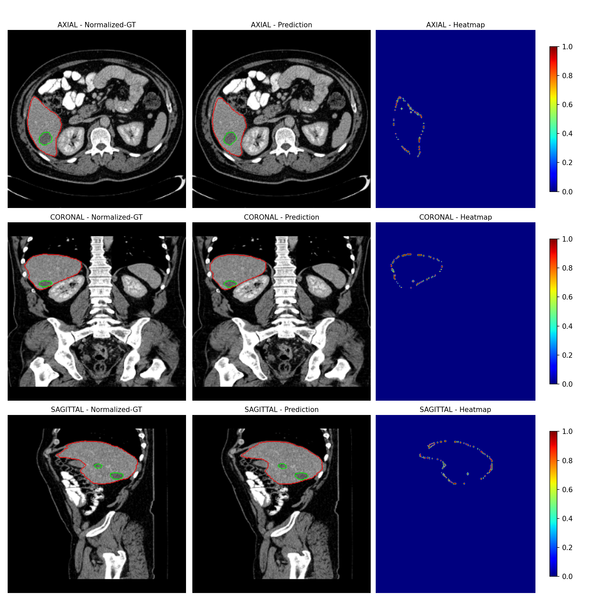
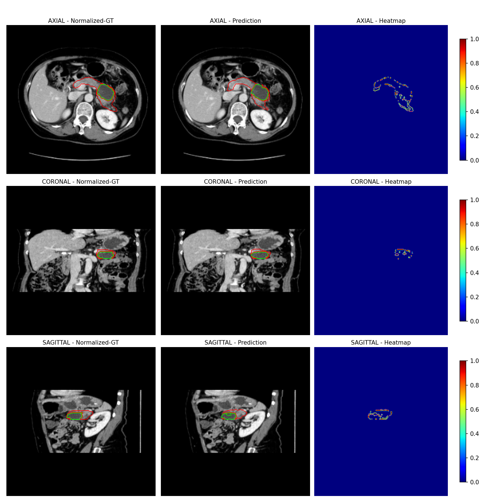

#  [BAUN3D: Boundary-Attentive 3D-UNet for Automatic Segmentation of Tumor-Prone Organs in Volumetric CT](https://openreview.net/forum?id=5TQK2jYr2a)


## Overview 

BAUN3D is a unique human anatomy-aware supervised deep learning radiomics for the localization and auto-segmentation of organs and tumors in volumetric CT images. Built specifically for contouring the challenging tumor-prone abdominal organs, the BAUN3D architecture comprises of: deformable cross attention (DCA), gated boundary refinement (GBR) module, and a composite loss objective function for handling empty masks, curriculum learning, extreme class imbalance, small tumor targets, and contour structural continuity.


## System requirements

- Python ≥ 3.8
- CUDA ≥ 11.8 (for GPU acceleration)
- 20GB+ GPU memory


## Architectural Innovation 

The BAUN3D's decoder stages were optimized with the implementation of: 
- Deformable Cross Attention (DCA) and
- Gated Boundary Refinement (GBR) morphological operators
<div align="left">
  
</div>


## Dataset

- This version of the BAUN3D model was trained and validated with the medical segmentation decathlon (MSD) LiTS and Pancreas benchmark [datasets](https://drive.google.com/drive/folders/1HqEgzS8BV2c7xYNrZdEAnrHk7osJJ--2). 

- Download link to the model weights will be updated later.

### Data Directory Structure
```
data/
├── lits/
│   ├── imagesTr/          # Training images (*.nii.gz)
│   ├── labelsTr/          # Training labels (*.nii.gz)
│   └── imagesTs/          # Test images
├── pancreas/
│   ├── imagesTr/
│   ├── labelsTr/
│   └── imagesTs/
└── ...
```

## Training CMD 
Set training flags accordingly, as exemplified below: 
```
python train.py --dataset lits --data_dir ./data --output_dir ./output/LiTS_Final --batch_size 2 --epochs 400 --skip_analysis
```

## Test | Inference 
The inference source-code, and running commands will be availed soon. 

## Comparative analysis of preprocessed data stats 

- Pancreas vs Liver: tumor voxel distributions
<table>
  <tr>
    <td align="center">
      
    </td>
    <td align="center">
      
    </td>
  </tr>
</table>

- Pancreas vs Liver: organ voxel distributions
<table>
  <tr>
    <td align="center">
      
    </td>
    <td align="center">
      
    </td>
  </tr>
</table>

- Pancreas vs Liver: per-class training size distributions
<table>
  <tr>
    <td align="center">
      
    </td>
    <td align="center">
      
    </td>
  </tr>
</table>

## Experimental Outcomes

### Quantitative results


| Dataset  | Organ Dice | Tumor Dice | Avg Dice | HD95 (mm)   |
|----------|------------|------------|----------|-------------|
| LiTS     | 0.95       | 0.71       | 0.83     | 10.78       |
| Pancreas | 0.91       | 0.78       | 0.84     | 7.55        |


### Qualitative results

<div align="left">
  
  <p><em>GT/Pred/Heatmap: liver-tumor boundary segmentation (Organ=red; Tumor=green)</em></p>
</div>
<div align="left">
  
  <p><em>GT/Pred/Heatmap: pancreas-tumor boundary segmentation (Organ=red; Tumor=green)</em></p>
</div>


## Citation 
BibTex: 
```
@inproceedings{BAUN3D2026,
  author    = {Agbodike, Obinna and Kuo, Chang-Fu},
  title     = {Boundary-Attentive 3D-UNet for Auto-Segmentation of
              Tumor-Prone Organs in Medical CT Volumes},
  booktitle = {Medical Imaging with Deep Learning (MIDL)-Short Papers},
  year      = {2026},
  address   = {Taipei, Taiwan},
  url       = {https://openreview.net/pdf?id=5TQK2jYr2a}
}
```


## Acknowledgements
This work was sponsored by CAIM: Linkou, Chang Gung Memorial Hospital, under project grant no. CLRPG3H0017.
